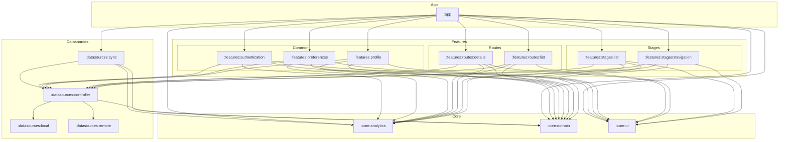

# Ma3 Routes (Matatu Route Helper)

Ma3 Routes is a specialized navigation assistant designed for Nairobi's informal transit network (Matatus). It focuses on providing a high-legibility, minimalist interface optimized for fast-paced, real-world commuting.

## Project Overview

Nairobi's transit system is vibrant but often complex to navigate for new users or when exploring new routes. Ma3 Routes aims to bridge this gap by providing clear, reliable, and locally-grounded route information.

## Dependency Graph

## Key Features

- **Matatu Yellow Theme**: A high-contrast design system optimized for outdoor and night-time legibility.
- **Route Guidance**: Quick access to route numbers, stages, and destinations.
- **Utility-First UI**: Minimalist interface built with Jetpack Compose for speed and clarity.

## Documentation

Comprehensive documentation is available in the `docs/` directory:

- [**Architecture**](docs/ARCHITECTURE.md): Technical stack, system design, and application structure.
- [**Design System**](docs/DESIGN.md): Visual language, typography, and color specifications.
- [**Data Model & Schema**](docs/schema.sql): Database schema for routes and stages.
- [**Data Strategy**](docs/DATA.md): Data sourcing and handling principles.

## Design Links

The project's visual specifications and prototypes can be found here:
- [**Stitch Design Specs**](https://stitch.withgoogle.com/projects/14128945751857227509)

## Getting Started

1. Open the project in Android Studio.
2. Ensure you have **JDK 17** or newer configured as your Gradle JDK.
3. Ensure you have the latest Android SDK - Panda (or newer) installed.
4. Sync the project with Gradle files.
5. Run the `app` module on an emulator or physical device.

## Core Technologies

- **Platform**: Android
- **Language**: Kotlin
- **UI Framework**: Jetpack Compose
- **Theme**: Material 3
