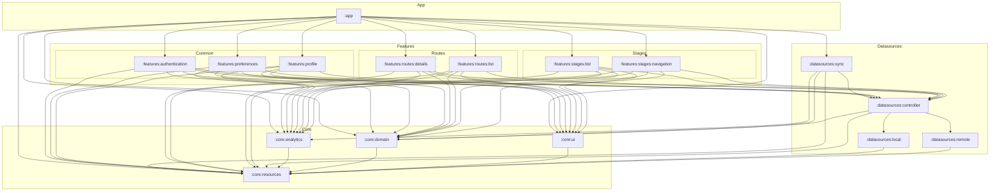

# Architecture Documentation

## Overview
This project follows a hybrid architecture combining **MVI (Model-View-Intent)** for the presentation layer and **Clean Architecture** for the overall system structure. It is designed to be highly modular, scalable, and offline-first.

The application adheres to the principle of **Dependency Inversion**, ensuring that high-level modules do not depend on low-level modules, but both depend on abstractions.

## Core Principles
- **Offline-First:** Features read data directly from the local database via `Flows`. The UI updates automatically when the database changes.
- **Unidirectional Data Flow (MVI):** State management is handled through immutable states and intents to ensure predictability.
- **Feature Modularity:** Each feature is self-contained and owns its own repository.
- **Sync Strategy:** The app performs periodic synchronization between remote and local data sources.

---

## Project Structure

### 1. Features
Each feature module contains its own UI, ViewModels, and Repositories.

- **Routes:**
    - `list`: Overview of available matatu routes.
    - `details`: Detailed information about a specific route.
- **Stages:**
    - `list`: List of stages for a specific route.
    - `navigation`: Real-time navigation and stage tracking.
- **Profile:** User profile management.
- **Preferences:** User settings and app configurations.
- **Authentication:** User sign-in, sign-up, and session management.

### 2. Datasources
Handles data retrieval, persistence, and synchronization.

- **Controller:**
    - The central entry point for all data operations. It orchestrates between local and remote sources and provides a unified API to the features.
- **Remote:**
    - Handles API calls, authentication network requests, and external service integrations.
- **Local:**
    - Manages the local database (SQLite/Room), preferences storage, and caching.
- **Sync:**
    - Orchestrates the synchronization logic. It depends on the Controller to define how to reconcile remote and local data.

### 3. Core
Shared infrastructure used across the entire application.

- **UI:**
    - **Theme:** Design system implementation (Colors, Typography, Shapes).
    - **Components:** Reusable UI elements.
    - **Navigation:** App-wide navigation logic (not location-based).
- **Resources:**
    - Shared Android resources that need to be reachable outside UI code, such as fonts, notification assets, and other cross-module resource IDs.
    - Exposes resource IDs through `ke.don.ma3routes.core.resources.Resources`.
    - App launcher icons remain app-owned and should not be moved into `core:resources`.
- **Domain:**
    - Holds the "Source of Truth" models.
    - Includes **Mappers** to convert between DTOs (Data Transfer Objects), Domain models, and Database Entities.
- **Analytics:**
    - Centralized logging and event tracking.

---

## Data Flow & Synchronization

### Feature Interaction
Features interact exclusively with the **Datasources Controller**. They do not have direct knowledge of whether data is coming from a local cache or a remote network.

### Sync Logic
The `sync` module runs periodically in the background. It interacts with the **Controller** to:
1. Fetch the latest data from the **Remote Datasource**.
2. Update the **Local Datasource**.
3. Handle conflict resolution.

### UI Interaction
1. **View** observes a `State` from the **ViewModel**.
2. **ViewModel** interacts with the **Repository** to get a `Flow` of data.
3. **User Actions** are sent as **Intents** to the **ViewModel**.
4. **ViewModel** processes intents and updates the `State`.

---

## Dependencies
The architecture follows a strict dependency hierarchy:
- **Features** depend on **Core** and **Datasources** (via the Controller).
- **Sync** (within Datasources) depends on the **Controller** to perform data reconciliation.
- **Resources** (within Core) is the shared resource boundary used by all app modules.

---

## Dependency Graph

